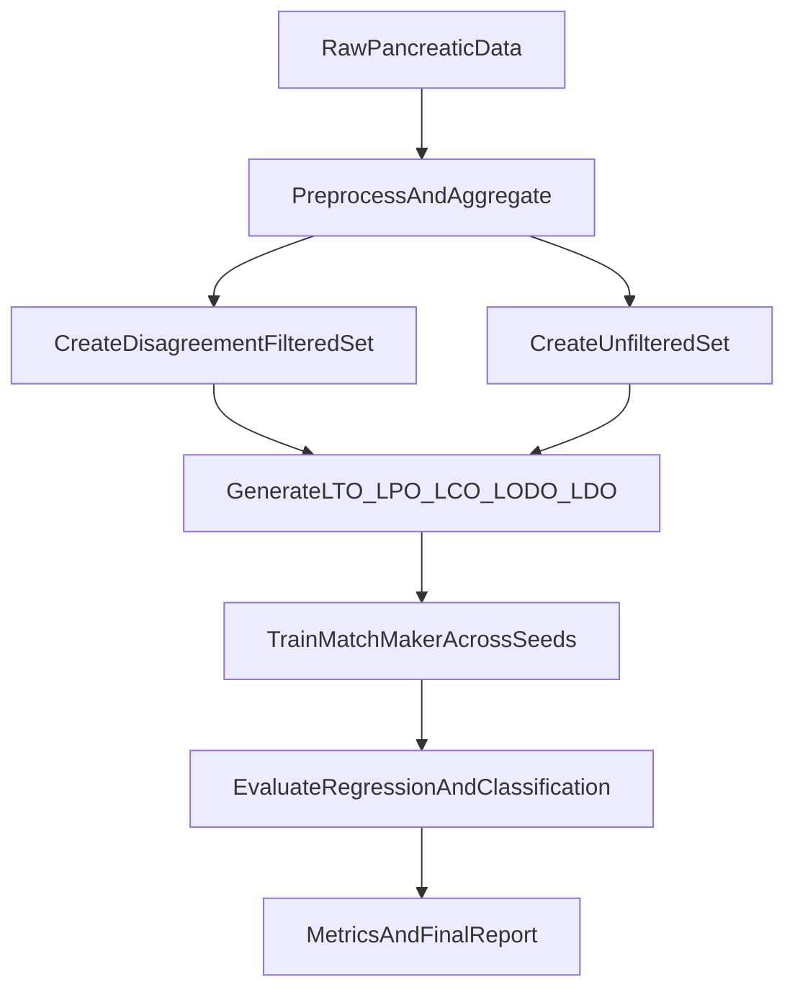

# Pancreatic MatchMaker Deney Planı

## Kapsam ve referanslar

- Ana kod tabanı: `[/Users/nilsarisik/Desktop/Desktop - nil’s MacBook Air 13.57.35/sabo/matchmaker_test/main.py](/Users/nilsarisik/Desktop/Desktop%20-%20nil%E2%80%99s%20MacBook%20Air%2013.57.35/sabo/matchmaker_test/main.py)`, `[/Users/nilsarisik/Desktop/Desktop - nil’s MacBook Air 13.57.35/sabo/matchmaker_test/MatchMaker.py](/Users/nilsarisik/Desktop/Desktop%20-%20nil%E2%80%99s%20MacBook%20Air%2013.57.35/sabo/matchmaker_test/MatchMaker.py)`
- Veri dosyaları: `[/Users/nilsarisik/Desktop/Desktop - nil’s MacBook Air 13.57.35/sabo/matchmaker_test/data/DrugCombinationData.tsv](/Users/nilsarisik/Desktop/Desktop%20-%20nil%E2%80%99s%20MacBook%20Air%2013.57.35/sabo/matchmaker_test/data/DrugCombinationData.tsv)`, `[/Users/nilsarisik/Desktop/Desktop - nil’s MacBook Air 13.57.35/sabo/matchmaker_test/data/synergy - comb - Combination data.csv](/Users/nilsarisik/Desktop/Desktop%20-%20nil%E2%80%99s%20MacBook%20Air%2013.57.35/sabo/matchmaker_test/data/synergy%20-%20comb%20-%20Combination%20data.csv)`
- Split referansı: Beyza OHE yaklaşımı (repo + paper tanımları): LTO, LPO, LCO, LODO, LDO
- Hedef: Hem sınıflandırma (`synergy_binary`) hem regresyon (Bliss sürekli skor)

## Faz 1 — Veri standardizasyonu ve disagreement filtresi

- Ham veriden tek bir kanonik tablo üret:
  - Anahtar: `(drug1_id, drug2_id, cell_line)`
  - Sınıflandırma etiketi: `synergy_binary`
  - Regresyon etiketi: `bliss`
- Tekrarlı tripletlerde disagreement analizi çıkar:
  - Çoğunluk oyu ile label, 
  - `agreement_rate` ve `n_replicates` kolonları,
  - `disagreement_flag` (`0/1`).
- İki eğitim dataseti üret:
  - `filtered`: disagreement içeren tripletler dışarıda
  - `unfiltered`: mevcut tüm tripletler (baseline)
- Çıktı: `data/processed/` altında versiyonlanmış CSV/TSV dosyaları + kısa data card.

## Faz 2 — Split üretimi (Beyza/OHE uyumlu)

- `random` split (LTO) ile hızlı baseline kur (en kolay senaryo).
- Sonra sistematik split indexleri üret:
  - `LPO`: test pair’leri train’de hiç görünmez
  - `LCO`: test cell line’ları train’de yok
  - `LODO`: çiftteki en az bir ilaç train’de hiç yok
  - `LDO`: testteki iki ilaç da train’de hiç yok
- Her split için `train/val/test` index dosyalarını kaydet (`splits/<split_name>/<seed>/`).
- Veri sızıntısı kontrollerini otomatik doğrula (pair/drug/cell-line overlap raporu).

## Faz 3 — Eğitim matrisi (retrain)

- Her split için 2 veri varyantı çalıştır:
  - `unfiltered` (kontrol)
  - `disagreement_filtered` (istenen esas koşul)
- Her koşulda en az 3 seed tekrarı (ortalama +- std raporlama için).
- Eğitim modları:
  - Regresyon: MatchMaker mevcut MSE/Spearman/Pearson
  - Sınıflandırma: bliss veya `synergy_binary` için AUC/AUPRC/F1 (eşik açıkça sabitlenmiş)

## Faz 4 — Değerlendirme ve raporlama

- Nihai karşılaştırma eksenleri:
  - Split türü: LTO/LPO/LCO/LODO/LDO
  - Veri filtresi: unfiltered vs disagreement_filtered
  - Görev tipi: classification vs regression
- Çıktılar:
  - `results/summary_metrics.csv`
  - `results/per_split_seed_metrics.csv`
  - kısa teknik rapor (`results/report.md`):
    - en iyi/istikrarlı senaryo
    - genelleme zorluğu sıralaması (LTO → LDO)
    - disagreement filtresinin kazanç/bedel analizi

## Yürütme sırası (pratik)

1. LTO + unfiltered ile smoke test
2. LTO + disagreement_filtered
3. LPO ve LCO
4. LODO ve LDO (en zor)
5. Tüm metriklerin toplu raporu

## Teknik notlar

- `main.py` içinde split altyapısı var (`files/random/kfold`), bunu genişleterek LPO/LCO/LODO/LDO index dosyalarıyla çalıştırmak en düşük riskli yol.
- `MatchMaker.py` mevcut pipeline’ı bozmayacak şekilde, veri hazırlama katmanına yeni işleme/split akışları eklenmeli.
- Ham pankreas verisinde replicate disagreement oranı yüksek görünüyor; bu nedenle filtreli/filtersiz çift koşul zorunlu tutulmalı.

## Akış diyagramı

